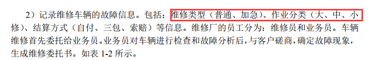
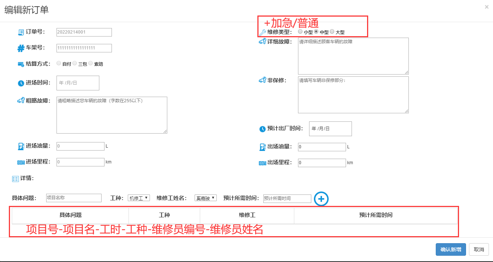
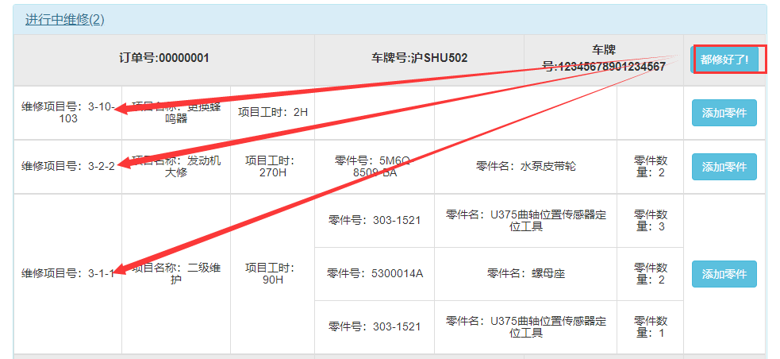
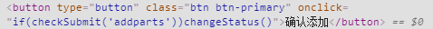
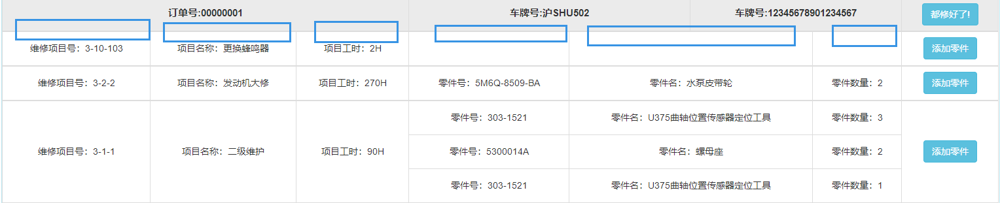

# 问题一览

## 用户界面

- [x] 都好啦

***

## 业务员界面

- [ ] 业务员的进行中订单记得改界面哦

- [ ] 业务员编辑订单页面，需要增加：加急、普通的维修类型，页面上的类型应该是作业分类；底下的表格标题也不对

- [ ] 

***

## 维修员界面

- [x] 工时≠小时

- [x] 车牌号车架号

- [x] 维修员修好了是对于单个维修项目而言的，不是对单个订单而言的

- [x] 都修好了”按钮，参数错误

- [x] 维修员没有任何必要查看PDF，后端就没给维修员查看PDF的权限

- [x] 不是拼音，是首字母

- [ ] 待确认的表也有过改动。这个样子的待确认表维修员并不能得到什么有效信息

- [x] 页面按钮的功能是没做吗？添加零件为啥用的changeStatus函数

- [ ] 进行中项目表格表头改正
