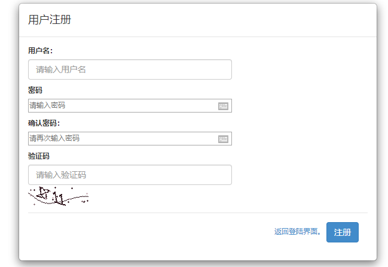
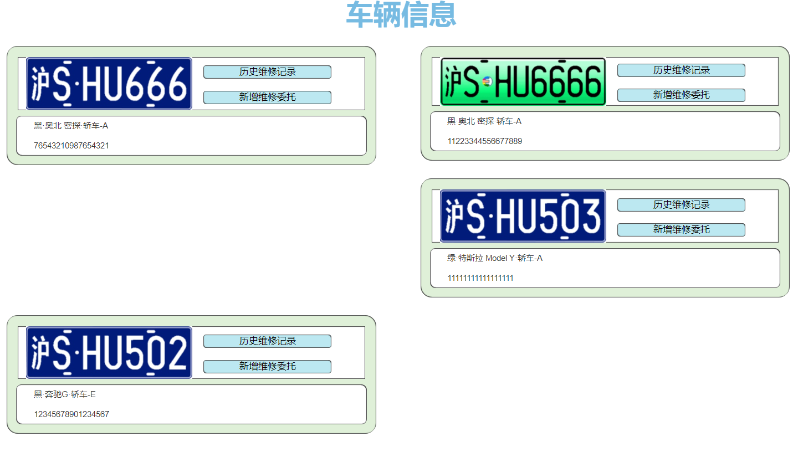
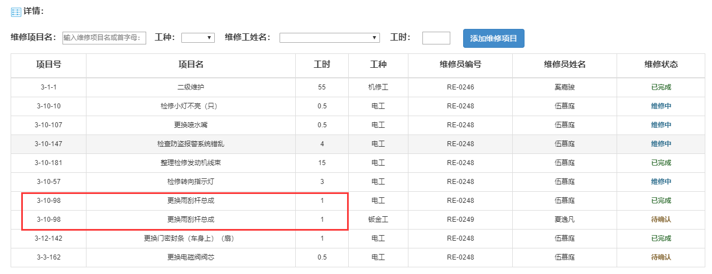
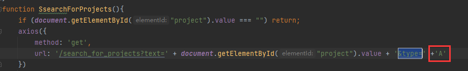
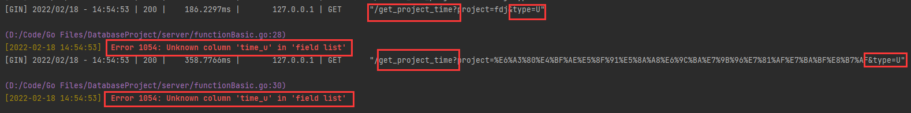
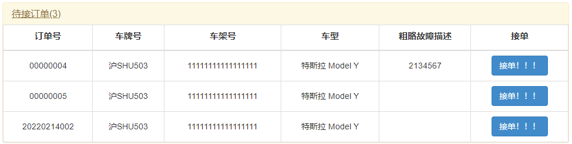
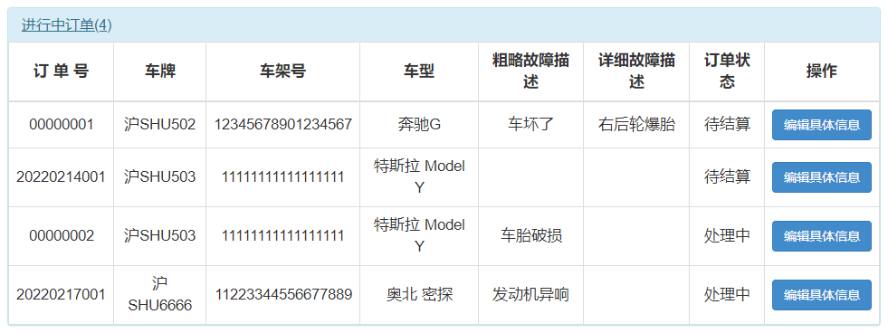
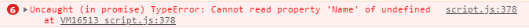
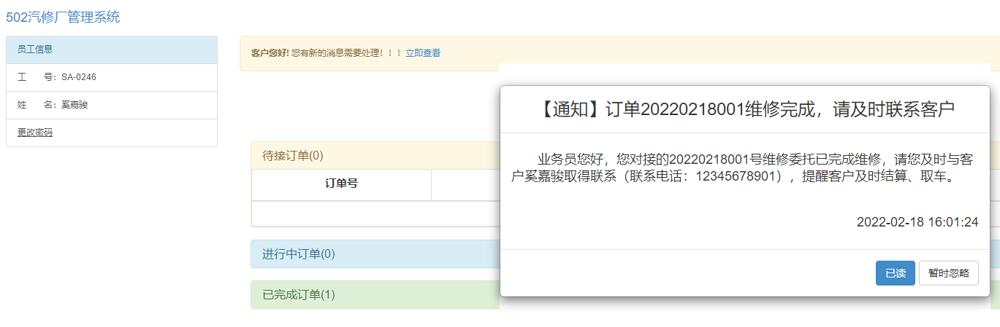
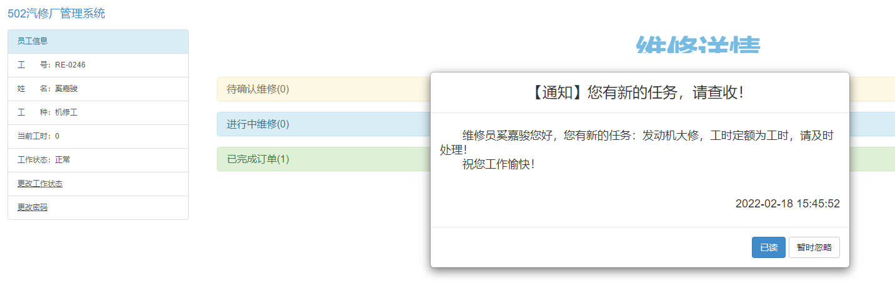

# 问题一览

## 其它界面

- [ ] 注册页面，密码框和用户名、验证码不一致（当然也有可能是浏览器对密码框进行了特殊处理，如果你们界面没有问题就不用管了）

## 用户界面

- [ ] 新增车辆页面，车牌号后边的那个问号没有写内容。内容应该指导用户如何填写，需要给出一张示例车牌和一个示例填写内容。
- [ ] 新能源车辆的车牌会导致div比蓝牌短，从而导致页面排版异常。

***

## 业务员界面

- [ ] 进入页面后，请将默认打开的设置为进行中订单，而不是待接订单。
- [ ] 编辑订单时，下方表格项目号、项目名、工时需要合并
- [ ] 此外，业务员查项目时固定车型为A，应该需要根据实际车型变化
- [ ] 初次编辑时（不知道还有没有其他情况下会发生），查询项目工时时，type=u，应该是undefined了，找一下问题出在哪。实在不行就用display:none改一下，不要用class了。
- [ ] 订单详情中，待接订单、已完成订单的字号与进行中订单字号不一致
- [ ] 添加维修项目后，需要将添加的这一行恢复初始状态（空）
- [ ] 查询完毕维修项目生成候选表格时，控制台报错undefined
- [ ] 有通知时，不应立即弹出，应于用户页面一致，点击“立即查看”后才弹出。此外，“客户您好”应改成业务员。

***

## 维修员界面

- [ ] 有通知时，不应立即弹出，应于用户页面一致，点击“立即查看”后才弹出。此外，本页面没有“立即查看”一栏。记得改成维修员。