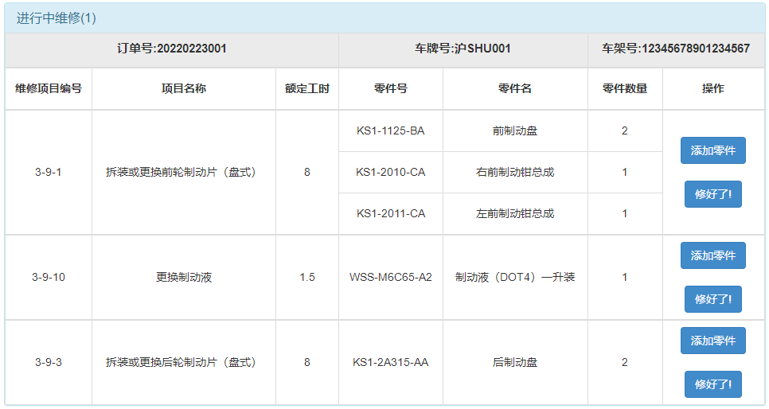

<h1>
    基于B/S的小型汽车维修管理系统
    </h1>

上海大学 2021-2022学年冬季学期《数据库原理》课程开发项目

​		首先感谢您能点开这个项目~这是我们的第一个开源项目，采用html+css+js+Golang（Gin框架）开发。经过验收，系统应该没有什么大的BUG。但是我们只有九周的课余时间来做这个项目，时间比较紧，部分细节的处理上可能会有一点小问题，如果遇到还请见谅~

​		这个项目已经部署在腾讯云服务器上了，欢迎在线体验~链接：https://www.shukachun.work:6502/index

------

[TOC]

------

## 开发环境

​		操作系统：已在Windows10、Windows11、Windows Server 2012 R2上完美运行本项目。在其他Windows版本应该也能使用。

​		数据库：MySQL

​		后端：Golang 1.17

​		使用框架：Gin V1.7.7

​		ORM框架：GORM V1.9.16

​		IDE：Goland 2021.2

## 开发要求

​		首先给出老师给的开发要求：

​	

## 界面截图

​		各个用户比较主要的界面如下：

### 客户：

#### 主页

​		(这里生成车牌使用的是另一位大佬的开源项目：https://gitee.com/leijd/chinese_license_plate_generator)

#### 绑定车辆

#### 新增委托

#### 进行中订单的实时生成委托书

#### 已完成订单界面

------

### 业务员

#### 接单

#### 进行中订单

#### 编辑订单

#### 添加/查看派工单

#### 打印委托书（PDF）

------

### 维修员

#### 确认维修

#### 进行中维修

#### 添加零件

#### 已完成维修

​		（懒得好好写MD了，就不写每个功能具体是怎么实现的了。）

## 本地环境配置指引

​		如果想clone在本地运行的话，首先需要确保安装了go与MySQL。需要在MySQL中新建一个名为database的数据库，并创一个用户名为admin，密码为123456的账号，确保该账号有管理database数据库的权限。

​		随后build server文件夹，注意是编译整个目录，如果没有报错的话，database数据库中应该会多出来许多表单项。此时将初始数据导入数据库，便可成功运行。

​		即使项目成功运行，车牌可能无法正常生成并显示。这样的话需要在cmd中运行一下车牌生成软件，看有什么报错信息，自己解决不了的百度解决。如果系统是Windows Server，并且报错信息是`ImportError: DLL load failed.`的话，可以参考这篇博客：https://blog.csdn.net/weixin_41713230/article/details/93306530

